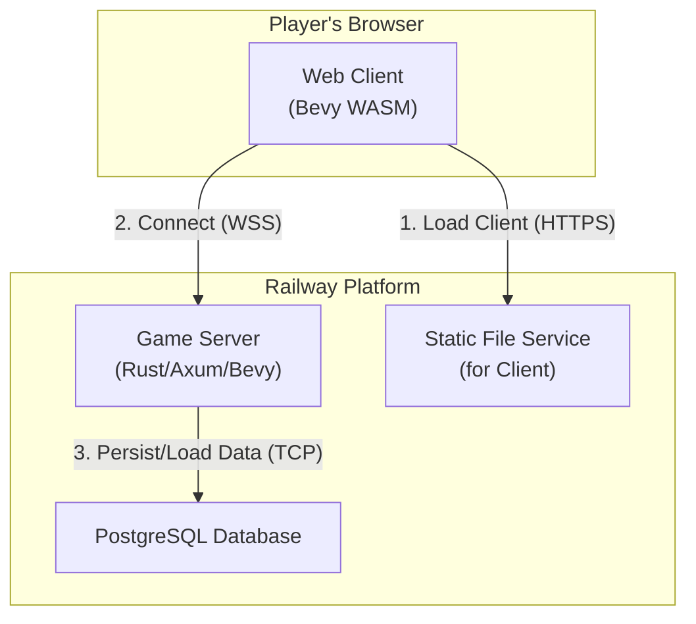

# IronVein: A Scalable Multiplayer Online World in Rust

## 1. High-Level Summary

IronVein is a massively multiplayer online game foundation built entirely in Rust. It serves as a proof-of-concept and robust starting point for creating a large-scale, real-time, persistent world. The project is architected as a set of microservices, featuring a Rust-based game server, a WebAssembly (WASM) client powered by the Bevy game engine, and a PostgreSQL database for data persistence.

This document outlines the project's vision, architecture, technology stack, data structures, and communication protocols. It is intended to be a comprehensive guide for developers, contributors, and any automated systems (like LLMs) that may interact with the codebase.

## 2. Project Vision

The primary goal of IronVein is to re-engineer a multiplayer world from the ground up in Rust to achieve massive scalability and performance, capable of supporting **1000+ concurrent players** in a single world instance.

The initial implementation is a simple online world where players appear as colored balls on a grid. They can see each other's real-time movement and click to navigate. This core functionality serves as a stable, high-performance foundation for a future full-fledged Massively Multiplayer Online Role-Playing Game (MMORPG).

## 3. Core Architecture

The system is designed as a set of three distinct services, typically deployed on a cloud platform like Railway, following a modern microservices pattern.

### Architecture Diagram



### Service Descriptions

*   **Game Server (The Core Logic)**: A headless Rust application that runs the main game loop. It processes player input, handles all game logic (movement, state changes), and serves as the single source of truth for the game state. It communicates with clients via WebSockets.
*   **Web Client (The View)**: A Rust application compiled to WebAssembly (WASM) that runs entirely in the user's browser. It is responsible for rendering the game world, capturing user input, and communicating with the Game Server.
*   **Database (The Long-Term Memory)**: A managed PostgreSQL instance that persists all permanent data, such as player accounts, character positions, and inventory.

## 4. Tech Stack

The technology stack was chosen for performance, safety, and modern development practices.

| Component       | Technology        | Rationale                                                                                                                                |
| --------------- | ----------------- | ---------------------------------------------------------------------------------------------------------------------------------------- |
| Language        | **Rust**          | Provides memory safety, zero-cost abstractions, and world-class performance for high-concurrency applications.                           |
| Game Engine     | **Bevy**          | A data-driven game engine using an Entity Component System (ECS) for maximum performance and scalability. Allows code sharing between server and client. |
| Web Server      | **Axum**          | A modern, ergonomic web framework for Rust with first-class support for WebSockets.                                                      |
| Database ORM    | **SQLx**          | An async, type-safe SQL toolkit that validates queries at compile-time, preventing entire classes of runtime errors.                       |
| Database        | **PostgreSQL**    | A powerful, reliable, and battle-tested open-source relational database.                                                                 |
| Serialization   | **Serde + bincode** | Serde provides the framework, and `bincode` provides an extremely fast and compact binary serialization format for network messages.       |
| WASM Client     | **Rust -> WASM**  | Compiles our Rust client code to run at near-native speed directly in the browser, enabling a shared language and logic with the server. |
| Client Bundler  | **Vite**          | A fast and simple frontend tool to bundle the HTML, JS glue, and WASM assets for the browser.                                            |

## 5. Project Structure (Cargo Workspace)

The project is structured as a Cargo workspace to facilitate code sharing between the `server`, `client`, and `shared` crates.

```bash
ironvein/
├── Cargo.toml          # The workspace manifest, defining the members below.
│
├── .github/workflows/  # (Optional) For CI/CD on Railway.
│
├── client/             # The Bevy WASM web client
│   ├── Cargo.toml      # Client-specific Rust dependencies (e.g., Bevy).
│   ├── index.html      # The HTML entry point for Vite.
│   ├── package.json    # JS dependencies (Vite, etc.).
│   └── src/            # Rust source for the WASM client (rendering, input).
│
├── server/             # The Axum + Bevy game server
│   ├── Cargo.toml      # Server-specific Rust dependencies (Axum, SQLx, etc.).
│   ├── Dockerfile      # For deploying the server to a container platform.
│   └── src/            # Rust source for the game server (logic, networking).
│
└── shared/             # Shared code between client and server
    ├── Cargo.toml      # Dependencies for shared code (serde, bevy).
    └── src/            # Rust source for shared types (components, network messages).
```

## 6. Shared Data Structures (`shared` crate)

These are the core data types shared between the server and client, defined in `shared/src/lib.rs`. They derive traits for Bevy's ECS (`Component`) and for network serialization (`Serialize`, `Deserialize`).

```rust
use bevy::prelude::Component;
use serde::{Deserialize, Serialize};

// A unique identifier for a player entity.
#[derive(Component, Serialize, Deserialize, Debug, Clone, Copy, PartialEq, Eq, Hash)]
pub struct PlayerId(pub u64);

// The player's current position on the grid.
#[derive(Component, Serialize, Deserialize, Debug, Clone, Copy, PartialEq)]
pub struct Position {
    pub x: f32,
    pub y: f32,
}

// The player's target destination. The server will move the player towards this.
#[derive(Component, Serialize, Deserialize, Debug, Clone, Copy, PartialEq)]
pub struct TargetDestination {
    pub x: f32,
    pub y: f32,
}

// A simple component to identify the player entity.
#[derive(Component, Serialize, Deserialize, Debug, Clone)]
pub struct Player;

// A simple component to identify entities controlled by other players.
#[derive(Component, Serialize, Deserialize, Debug, Clone)]
pub struct Enemy;

// Game configuration that can be sent to the client on connection.
#[derive(Serialize, Deserialize, Debug, Clone)]
pub struct GameConfig {
    pub map_width: u32,
    pub map_height: u32,
}
```

## 7. Communication Protocol (WebSocket)

All real-time communication happens over a single WebSocket connection. Messages are serialized into a compact binary format using `bincode`.

### Client-to-Server Messages

Messages sent **from** the Client **to** the Server.

```rust
// Defined in shared/src/lib.rs
#[derive(Serialize, Deserialize, Debug)]
pub enum ClientToServerMsg {
    // Sent when the player clicks on the map to set a new destination.
    ClickPosition { x: f32, y: f32 },
    // A keep-alive message to maintain the connection.
    Ping,
}
```

### Server-to-Client Messages

Messages sent **from** the Server **to** the Client.

```rust
// Defined in shared/src/lib.rs
#[derive(Serialize, Deserialize, Debug)]
pub enum ServerToClientMsg {
    // Sent once on connection to give the client its ID and the game config.
    Welcome { player_id: PlayerId, config: GameConfig },
    // A full snapshot of all player positions. Sent periodically.
    WorldStateSnapshot(Vec<(PlayerId, Position)>),
    // Informs clients that a new player has joined.
    PlayerJoined(PlayerId, Position),
    // Informs clients that a player has left.
    PlayerLeft(PlayerId),
    // A keep-alive response.
    Pong,
}
```

## 8. Database Schema (PostgreSQL)

A simple schema to store player data. The server uses SQLx to interact with this table.

```sql
-- Migration file: 001_create_players_table.sql
CREATE TABLE players (
    id BIGSERIAL PRIMARY KEY,
    username VARCHAR(32) UNIQUE NOT NULL,
    -- In a real app, this would be a securely hashed password.
    -- For this prototype, a simple text field is acceptable.
    password_hash TEXT NOT NULL,
    last_position_x REAL NOT NULL DEFAULT 0.0,
    last_position_y REAL NOT NULL DEFAULT 0.0,
    created_at TIMESTAMPTZ NOT NULL DEFAULT NOW(),
    last_login_at TIMESTAMPTZ
);
```

## 9. Development and Build Plan (Roadmap)

This project is being implemented in sequential order.

-   [x] **Workspace Setup**: Create the Cargo workspace and the `server`, `client`, and `shared` crates as defined in section 4.
-   [x] **Basic WebSocket Server**: Implement a minimal Axum server that accepts a WebSocket connection, prints a message, and closes.
-   [x] **Basic WASM Client**: Create a minimal Bevy client that compiles to WASM, draws a blue background, and connects to the WebSocket server.
-   [x] **Implement Protocol**: Add the `ClientToServerMsg` and `ServerToClientMsg` enums to the `shared` crate. Implement `bincode` serialization/deserialization on both ends.
-   [x] **Player Spawning (Server)**:
    -   On WebSocket connect, spawn a new Bevy entity with `Player`, `PlayerId`, and a default `Position`.
    -   Broadcast a `ServerToClientMsg::PlayerJoined` message to all other clients.
    -   Send the `ServerToClientMsg::Welcome` message to the new client.
-   [x] **Player Rendering (Client)**:
    -   When the client receives `Welcome`, it should store its own `PlayerId`.
    -   When receiving a `WorldStateSnapshot` or `PlayerJoined` message, it should spawn entities with `Position` components.
    -   Render its own player entity as a blue ball and all other players as red balls.
-   [x] **Movement Logic**:
    -   **Client**: On click, send a `ClientToServerMsg::ClickPosition` message.
    -   **Server**: On receiving `ClickPosition`, update the `TargetDestination` component for that player's entity.
    -   **Server**: Create a Bevy system that iterates through entities with `Position` and `TargetDestination` and moves them slightly closer each frame (simple linear interpolation).
    -   **Server**: Create a Bevy system that periodically broadcasts a `WorldStateSnapshot` of all player positions to all clients.
    -   **Client**: When receiving `WorldStateSnapshot`, update the `Position` of all rendered entities, which will move them on screen.
-   [ ] **Database Integration**:
    -   Use `sqlx-cli` to set up migrations.
    -   On WebSocket connect (before spawning), perform a mock "login" and load/save the player's `last_position` from the PostgreSQL database.
-   [ ] **Deployment**: Configure `Dockerfile` and `railway.json` to deploy the three services to Railway.
